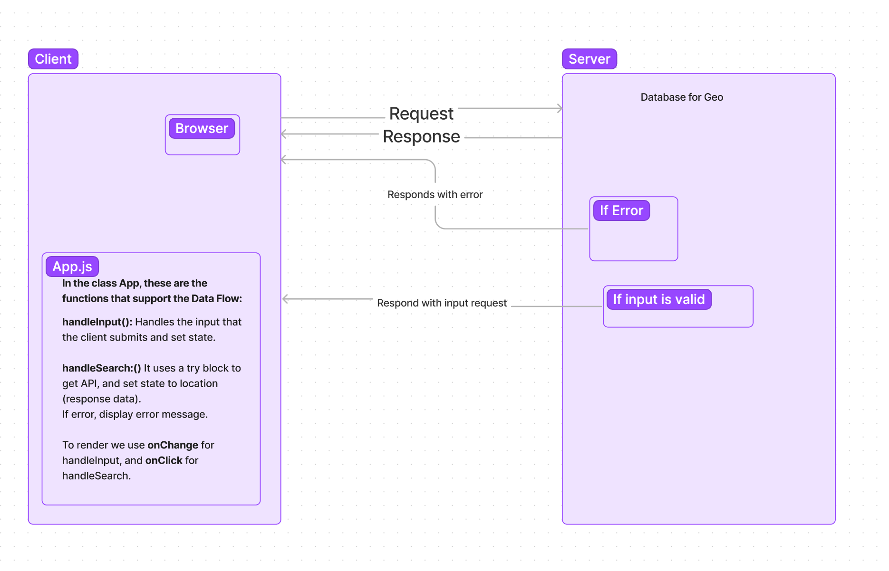

# City Explorer

## Data Flow for City Explorer Web Request-Response Cycle

## WRRC Outline of Functions

- For the web request-responce cycle, the client(browser), requests the Get API for geo location. If the response is invalid(false), a error message will display, which is handled by the handleSearch method. If the request is valid (true), the request of the location will be sent to the client, displaying the location and map, also handled by the handleSearch method.

- The handleInput method handles the input that the user submits, and set state.
- To render we onChange for handleInput, and onClick for handleSearch.
